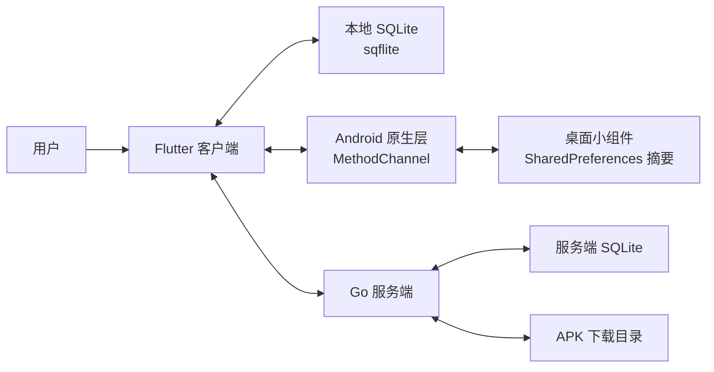
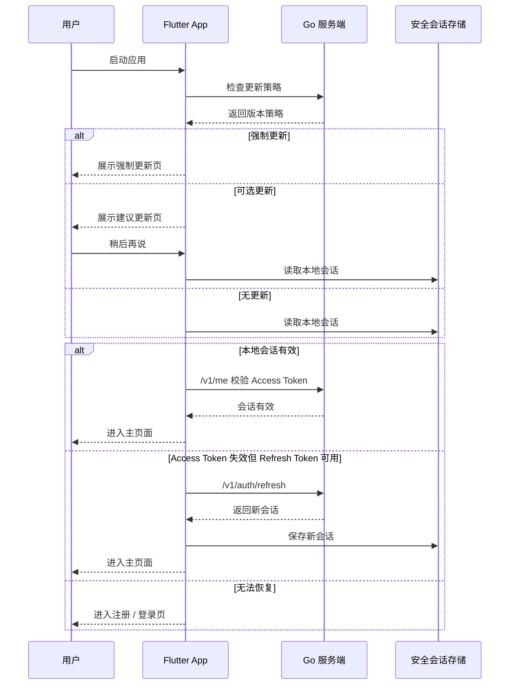

# 平生 Life 项目详细设计文档

更新时间：2026-06-28  
当前代码基线：`1.0.14+15`

## 1. 文档目的

本文档基于当前仓库的真实实现状态，整理平生 Life 的详细设计，用于回答 3 个问题：

1. 现在这个项目实际上是怎样组织和运行的。
2. 当前哪些设计已经成型，哪些地方仍然是原型期做法。
3. 下一阶段应该优先改什么，以及为什么要这样排顺序。

本文档优先描述“现状设计”，在最后单独给出“演进建议”和“当前行动顺序”，避免把规划和现状混写。

## 2. 项目定义

### 2.1 产品定位

平生 Life 是一个以 Android 为主的本地优先生活管理 App。它关注的不是复杂协同，也不是强云端依赖，而是把个人每天最常发生的记录和提醒浓缩成一个生活工作台。

当前产品围绕 6 个方向展开：

- 计划：今天要做什么
- 财务：今天花了什么、资产状态如何
- 饮食：今天吃了什么
- 锻炼：今天完成了什么训练
- 健康：今天身体状态如何
- 桌面小组件：不打开 App 也能看摘要、做快捷记录

### 2.2 当前产品哲学

从代码和运行方式看，这个项目已经明确体现出以下设计哲学：

- 本地优先：大部分核心记录和浏览流程不依赖服务端。
- 模块联动：计划、财务、饮食、锻炼、健康之间存在轻量联动。
- Android 深度集成：小组件、Health Connect、传感器、安全存储不是边角功能，而是一等能力。
- 服务端收敛：服务端只做账号、Token、更新策略和 APK 下载，不承担主业务状态。

### 2.3 非目标

当前系统没有把以下方向作为第一阶段目标：

- 多端同步
- 团队协作
- 大规模后台运营系统
- 高并发业务平台
- 复杂云端分析与推荐

这意味着后续设计判断应该继续围绕“单机可用、局域网可更新、模块逐步细化”的产品路线，而不是提前把系统做成重平台。

## 3. 系统总览

### 3.1 总体架构图



### 3.2 四层边界

当前系统可以稳定划分为 4 层：

| 层级 | 责任 | 当前实现 |
|---|---|---|
| 客户端表现层 | 页面、交互、模块联动、状态汇总 | Flutter |
| 本地数据层 | App 主数据存储 | `sqflite` |
| Android 原生能力层 | 小组件、Health Connect、传感器、会话安全存储、更新拉起 | Kotlin + `MethodChannel` |
| 轻量服务端层 | 认证、Token、更新策略、下载 | Go + SQLite |

### 3.3 核心判断

这个系统现在最准确的定义不是“一个普通 Flutter App”，而是：

> 一个以 Flutter 为主界面、以本地 SQLite 为主数据源、由 Android 原生层扩展系统能力、由 Go 服务端补充账号与版本分发的本地优先生命管理工具。

## 4. 仓库结构与代码组织

### 4.1 当前目录结构

```text
lib/
  main.dart
  app/
  auth/
  api/
  home/
  models/
  modules/
    plan/
    finance/
    food/
    workout/
    health/
  shared/
  storage/

android/app/src/main/kotlin/com/pingsheng/pingsheng_life/
server/
test/
docs/
ui_design/
```

### 4.2 当前组织方式的真实情况

虽然目录已经按 `app / auth / api / models / modules / storage / shared` 分开，但 Flutter 代码目前仍是 `single library + part files` 结构。

[lib/main.dart](E:\claudecode\pingsheng_life_source\lib\main.dart) 使用 `part` 把以下文件挂到同一个库：

- `app/app.dart`
- `auth/auth.dart`
- `api/pingsheng_api.dart`
- `models/life_data.dart`
- `models/system_health.dart`
- `storage/app_data_store.dart`
- `storage/widget_store.dart`
- `home/life_home_page.dart`
- `modules/*`
- `shared/module_shell.dart`

### 4.3 这种结构的收益

- 初期迭代快；
- 共享私有类型和常量比较方便；
- 跨文件修改的心理成本低；
- 对原型阶段很友好。

### 4.4 这种结构的代价

- 模块边界弱，容易出现隐式依赖；
- 页面状态、模型、存储逻辑之间更容易缠在一起；
- 随着模块变多，单次修改影响面变大；
- 测试隔离和长期维护会变难。

因此，这个结构适合第一阶段，但不适合继续无限扩张。

## 5. Flutter 客户端详细设计

### 5.1 App 外壳

[lib/app/app.dart](E:\claudecode\pingsheng_life_source\lib\app\app.dart) 是应用外壳，负责：

- `PingShengApp` 定义
- `MaterialApp` 配置
- 主题与全局样式
- 版本信息默认值
- 路由入口

当前路由虽包含 `/finance`、`/plan`、`/food`、`/workout`、`/health`，但这些并不是完全独立的应用页面树，而是进入同一套主界面后切换模块视图。

### 5.2 启动闸门

[lib/auth/auth.dart](E:\claudecode\pingsheng_life_source\lib\auth\auth.dart) 里的 `_AuthGate` 承担启动总控逻辑，状态枚举为：

- `checking`
- `blocked`
- `updateAvailable`
- `signedOut`
- `signedIn`

启动顺序如下：



这个流程说明：认证并不是孤立表单，而是“更新、恢复会话、认证入口”合并后的统一启动策略。

### 5.3 首页状态中枢

[lib/home/life_home_page.dart](E:\claudecode\pingsheng_life_source\lib\home\life_home_page.dart) 是当前 App 的状态中枢。

`_LifeHomePageState` 直接持有以下应用级状态：

| 状态 | 说明 |
|---|---|
| `_module` | 当前一级模块 |
| `_pendingQuickAction` | 待消费的小组件快捷动作 |
| `_recordedFoodCalories` | 已记录热量 |
| `_aiFinanceEndpoint / Model / ApiKey` | AI 财务配置 |
| `_workoutGroupsByAction` | 各动作完成组数 |
| `_events` | 应用级生活事件流 |
| `_todos` | 待办与计划数据 |
| `_financeRecords` | 财务记录数据 |

这说明当前架构采用的是：

> 应用级集中状态 + 模块页参数下发 + 局部回调上收

这种模式短期高效，但继续膨胀后会导致以下问题：

- 页面承担过多领域职责；
- 模块本身变得难以独立测试；
- 状态、存储、联动和展示开始混写在一个状态类中；
- 局部功能越做越快，全局结构越积越重。

### 5.4 小组件入口对首页的影响

`LifeHomePage` 在初始化时会读取 Android 初始路由，并解析：

- 目标模块
- 快捷动作名称

对应逻辑体现在：

- `_moduleFromRoute`
- `_quickActionFromRoute`
- `_handleWidgetQuickAction`

这说明首页不只是普通页面容器，它还是小组件冷启动和热启动回流的汇合点。

## 6. 模块设计

### 6.1 模块职责总表

| 模块 | 当前职责 | 成熟度判断 |
|---|---|---|
| 计划 | 今日计划、待办箱、周视图、复盘、联动 | 最高 |
| 财务 | 记录、概览、AI 记账入口 | 中等，模型偏轻 |
| 饮食 | 热量记录、模板化雏形、趋势雏形 | 中等偏原型 |
| 锻炼 | 动作、组数、训练状态、联动 | 中等偏原型 |
| 健康 | Health Connect、传感器、状态卡片 | 中等，强依赖原生层 |

### 6.2 计划模块

[lib/modules/plan/plan_module.dart](E:\claudecode\pingsheng_life_source\lib\modules\plan\plan_module.dart) 目前是全项目业务最成熟的模块。

它背后的模型能力已经明显多于其他模块，包括：

- 分类
- 优先级
- 状态
- 日期
- 重复规则
- 备注
- 待办箱
- 模块联动
- 延后次数
- 完成时间

核心模型 `TodoItem` 当前字段包括：

- `id`
- `title`
- `category`
- `color`
- `priority`
- `status`
- `dueDate`
- `note`
- `repeatRule`
- `linkedModules`
- `postponedCount`
- `createdAt`
- `completedAt`

这意味着计划模块已经初步具备“领域模型优先”的基础。

### 6.3 财务模块

[lib/modules/finance/finance_module.dart](E:\claudecode\pingsheng_life_source\lib\modules\finance\finance_module.dart) 当前已经有可用交互，但底层数据模型仍然轻量。

`FinanceRecord` 当前字段只有：

- `title`
- `subtitle`
- `amount`
- `type`
- `date`
- `icon`（运行时映射）

它更像“可展示记录”，而不是“完整账务实体”。  
这正是财务模块下一步最需要补强的地方，因为未来想做：

- 预算
- 固定支出
- 账户
- 分类统计
- 异常提醒

都需要更稳定的数据模型边界。

### 6.4 饮食模块

[lib/modules/food/food_module.dart](E:\claudecode\pingsheng_life_source\lib\modules\food\food_module.dart) 当前已经与应用级热量状态联动，但模型层还没有完全沉下来。

从现状看，它更偏向“交互原型已经建立，结构层还需要加深”的模块。

短期最合适的方向不是继续堆更多展示，而是先把以下对象抽稳定：

- 食物项
- 餐次
- 食物模板
- 常吃组合
- 每日摄入汇总

### 6.5 锻炼模块

[lib/modules/workout/workout_module.dart](E:\claudecode\pingsheng_life_source\lib\modules\workout\workout_module.dart) 当前重点是今日训练和组数记录。

应用级只持有 `Map<String, int> _workoutGroupsByAction` 这种摘要式状态，说明：

- 当前核心目标是“今天做了几组什么动作”
- 还没有进入“训练历史、动作进步曲线、负重趋势”这一层次

这对第一阶段是合理的，但如果继续深化训练模块，就需要从“摘要状态”走向“训练记录实体”。

### 6.6 健康模块

[lib/modules/health/health_module.dart](E:\claudecode\pingsheng_life_source\lib\modules\health\health_module.dart) 的特别之处在于：它不是纯 Flutter 本地页面，而是依赖原生层采集系统能力。

当前健康信息由两部分组成：

- 系统记录：步数、活动消耗、睡眠、心率、呼吸
- 设备能力：传感器与授权状态

因此健康模块实际承担两个任务：

1. 呈现今天的健康数据
2. 呈现设备当前能否提供这些健康数据

## 7. 通用壳层与导航设计

[lib/shared/module_shell.dart](E:\claudecode\pingsheng_life_source\lib\shared\module_shell.dart) 承担模块通用外壳职责，包括：

- 一级模块导航
- 二级导航承载
- 模块顶部 / 底部结构统一
- 通用弹层、面板、表面样式

这部分的价值是把不同业务模块收敛到一套统一外观和交互骨架上。  
它的风险也很明显：一旦视觉结构和模块业务耦合过深，后续某个模块想独立变化就会被通用壳反向限制。

因此，共享壳层的设计目标应当是：

- 统一导航与基座
- 不侵入模块内部领域逻辑
- 不把所有模块都磨成完全一样的内部结构

## 8. 客户端数据模型与本地存储设计

### 8.1 当前主模型

[lib/models/life_data.dart](E:\claudecode\pingsheng_life_source\lib\models\life_data.dart) 里最关键的聚合对象是 `LifeSummarySnapshot`。

它当前负责打包以下应用级数据：

- `foodCalories`
- `workoutGroupsByAction`
- `todos`
- `financeRecords`
- AI 财务配置

这说明当前客户端存储的基本单位仍然偏“应用快照”，而不是完全独立的领域仓储对象。

### 8.2 本地 SQLite 的角色

[lib/storage/app_data_store.dart](E:\claudecode\pingsheng_life_source\lib\storage\app_data_store.dart) 现在已经把 SQLite 作为 App 主数据源。

这是一个重要转折点，因为它明确区分了：

- App 主数据：SQLite
- 小组件摘要：原生侧 `SharedPreferences`

### 8.3 当前表结构

当前客户端本地库主要包含 4 张表：

| 表名 | 用途 | 关键字段 |
|---|---|---|
| `app_meta` | 应用级元信息 | `key`、`value` |
| `todos` | 计划 / 待办数据 | `todoId`、`title`、`category`、`priority`、`status`、`dueDate`、`repeatRule` 等 |
| `finance_records` | 财务记录 | `title`、`subtitle`、`amount`、`type`、`date` |
| `workout_groups` | 每个动作的完成组数 | `actionName`、`groups` |

更具体的字段现状如下：

#### `app_meta`

- `initialized`
- `foodCalories`
- `aiFinanceEndpoint`
- `aiFinanceModel`
- `aiFinanceApiKey`

#### `todos`

- `position`
- `todoId`
- `title`
- `category`
- `done`
- `priority`
- `status`
- `dueDate`
- `note`
- `repeatRule`
- `linkedModulesJson`
- `postponedCount`
- `createdAt`
- `completedAt`

#### `finance_records`

- `position`
- `title`
- `subtitle`
- `amount`
- `type`
- `date`

#### `workout_groups`

- `actionName`
- `groups`

### 8.4 当前读写策略

当前保存策略不是“增量更新单条记录”，而是“事务内清空相关表后整体写回”：

1. 删除 `app_meta / todos / finance_records / workout_groups`
2. 重新写入当前内存快照
3. 下次启动时整体恢复

这套做法的优点：

- 简单
- 稳定
- 对单用户单端场景足够直接

这套做法的局限：

- 写入粒度粗
- 不利于后续复杂查询和局部回滚
- 数据层仍与页面状态强绑定

### 8.5 当前存储边界判断

所以客户端虽然已经“用上了 SQLite”，但还没有完全进入“Repository 驱动的领域存储”阶段。  
更准确的说法是：

> 现在的客户端已经脱离了纯内存原型，但仍然处在“快照式本地持久化”阶段。

## 9. Android 原生层设计

### 9.1 原生层不是薄壳

[android/app/src/main/kotlin/com/pingsheng/pingsheng_life/MainActivity.kt](E:\claudecode\pingsheng_life_source\android\app\src\main\kotlin\com\pingsheng\pingsheng_life\MainActivity.kt) 当前承担的职责已经远超“启动 Flutter”：

- 小组件摘要读写
- 小组件点击回流
- Health Connect 状态与数据读取
- 权限申请
- 本机传感器注册
- 登录态安全存储
- 下载 URL 打开

这意味着 Android 原生层是独立子系统，不是简单容器。

### 9.2 当前 `MethodChannel` 合同

| Channel | 责任 |
|---|---|
| `pingsheng_life/widget_summary` | 小组件摘要同步、快捷动作回流 |
| `pingsheng_life/system_health` | 健康系统快照与权限请求 |
| `pingsheng_life/auth_session` | 会话读取、保存、清理 |
| `pingsheng_life/update_launcher` | 拉起下载地址 |

### 9.3 小组件设计边界

当前小组件承担的是“摘要层”和“快捷入口层”，不承担主数据层：

- 展示摘要
- 接收快捷点击
- 把点击事件交回 Flutter
- 在原生侧保存轻量摘要，保证桌面刷新可用

这个边界是合理的，因为小组件天然适合轻量、快速、可离线展示的数据，不适合作为业务主数据库。

### 9.4 健康能力设计

原生层对 Health Connect 的状态区分已经比较明确，至少包含：

- `unavailable`
- `updateRequired`
- `permissionRequired`
- 可用状态

同时，它还会注册以下传感器：

- `TYPE_STEP_COUNTER`
- `TYPE_HEART_RATE`
- `TYPE_ACCELEROMETER`

这表明健康模块当前设计不仅关心“拿到了多少数据”，也关心“当前设备是否具备这些能力”。

### 9.5 登录态安全设计

会话数据通过 `EncryptedSharedPreferences` 保存，而不是普通 `SharedPreferences`。

这带来 3 个直接收益：

1. Access Token / Refresh Token 不再明文暴露。
2. Flutter 层不需要直接接触平台安全细节。
3. 安全边界集中在原生层，利于后续替换实现。

在当前项目里，这一块设计是明显成熟于其他模块的。

## 10. Go 服务端详细设计

### 10.1 服务端定位

[server/main.go](E:\claudecode\pingsheng_life_source\server\main.go) 的职责非常聚焦：

- 邮箱 / 手机注册
- 邮箱 / 手机登录
- Refresh Token 轮换
- 退出登录
- 当前用户校验
- 版本更新策略下发
- 管理员更新策略写入
- APK 静态下载

### 10.2 路由边界

当前已开放的核心路由包括：

| 方法 | 路径 | 用途 |
|---|---|---|
| `POST` | `/v1/auth/register/email` | 邮箱注册 |
| `POST` | `/v1/auth/register/phone` | 手机注册 |
| `POST` | `/v1/auth/login/email` | 邮箱登录 |
| `POST` | `/v1/auth/login/phone` | 手机登录 |
| `POST` | `/v1/auth/refresh` | 刷新会话 |
| `POST` | `/v1/auth/logout` | 退出登录 |
| `GET` | `/v1/me` | 校验当前用户 |
| `GET/POST` | `/v1/app/update` | 获取更新策略 |
| `PUT` | `/v1/admin/update-policy` | 更新发布策略 |
| `GET` | `/downloads/<filename>` | 下载 APK |

### 10.3 当前数据实体

服务端内部聚合结构 `dbFile` 仍然包含：

- `Users`
- `RefreshTokens`
- `UpdatePolicy`

这与旧 JSON 时代的聚合结构保持了一致，也解释了为什么当前 SQLite 之上仍然保留了较强的“整体读写”思路。

### 10.4 服务端 SQLite 表结构

服务端当前库主要包含 4 张表：

| 表名 | 用途 |
|---|---|
| `users` | 用户基础信息 |
| `refresh_tokens` | Refresh Token 轮换存储 |
| `update_policy` | 客户端更新策略 |
| `app_meta` | 迁移或运行标记 |

关键字段如下：

#### `users`

- `id`
- `email`
- `phone`
- `display_name`
- `password_hash`
- `created_at`
- `updated_at`

#### `refresh_tokens`

- `id`
- `user_id`
- `token_hash`
- `created_at`
- `expires_at`

#### `update_policy`

- `platform`
- `latest_version_code`
- `latest_version_name`
- `min_supported_version_code`
- `download_url`
- `release_notes_json`
- `message`
- `updated_at`

### 10.5 认证安全模型

当前服务端对手机号和邮箱都做了规范化处理，并通过：

- 正则校验
- 密码校验
- Access Token
- Refresh Token 哈希存储
- Refresh Token 轮换失效

形成了一套移动端可用的基础认证模型。

特别值得注意的是：

- Refresh Token 在库中保存的是哈希值，不是原文；
- 旧 Refresh Token 在轮换后会失效；
- `/v1/me` 可以用来校验现有 Access Token 是否仍可用。

### 10.6 当前数据访问模式

虽然底层存储介质已经换成 SQLite，但业务访问层仍大量依赖：

- `readDB()`
- `writeDB()`

其本质仍然偏向“按聚合整体读出，再整体写回”。  
所以当前服务端的真实状态是：

> SQLite 已经落地，但使用方式还带着 JSON 时代的整体快照习惯。

这不是 bug，但它解释了为什么服务端虽然数据库化了，却还没有完全享受到数据库带来的局部更新、查询和演进优势。

### 10.7 更新分发模型

服务端通过 `update_policy` 保存当前版本策略，客户端每次启动优先读取它。

当前更新模型包含：

- 最新版本号
- 最低支持版本号
- 下载地址
- 更新说明
- 提示文案

它更像“私有更新通道”，而不是应用商店体系。

## 11. 客户端与服务端的数据边界

当前边界非常清楚：

### 11.1 服务端掌握的数据

- 用户账号
- 密码哈希
- Refresh Token 哈希
- 更新策略
- APK 下载地址

### 11.2 客户端掌握的数据

- 待办
- 财务记录
- 饮食记录摘要
- 锻炼组数摘要
- 健康展示状态
- AI 财务配置

### 11.3 结论

当前系统是“账号云端化、生活数据本地化”的架构。  
这是一个很重要的设计事实，因为它直接决定：

- 当前不适合引入复杂远程同步；
- 后续改进优先顺序应该先在本地数据模型和模块结构上发力；
- 服务端暂时不需要承担业务数据中心角色。

## 12. 质量保障与测试设计

### 12.1 当前测试现状

仓库当前已包含：

- Flutter 侧 `widget_test.dart`
- 认证相关 smoke / preview / font probe 测试
- Go 侧 `server/main_test.go`

当前 Go 测试已经覆盖的重要路径包括：

- 注册登录
- Refresh Token 轮换
- 更新策略写入
- APK 下载
- 旧 JSON 到 SQLite 的迁移

### 12.2 当前测试短板

现阶段最明显的测试短板不在“完全没有测试”，而在“测试粒度还偏粗”：

- Flutter 侧以页面和流程测试为主
- 模块内部的独立逻辑测试较少
- 本地存储层缺少更细的行为验证
- 模块联动逻辑尚未被分层验证

### 12.3 质量结论

当前测试足以支撑持续开发，但不足以支撑大规模结构重构。  
这也是为什么下一步如果要拆架构，应该先拆出清晰边界，再补对应层级测试，而不是直接大改页面。

## 13. 发布与部署设计

### 13.1 当前发布模型

当前发布链路是：

1. Flutter 更新版本号。
2. 构建 APK。
3. 将 APK 放到服务端 `downloads/` 目录。
4. 调用管理员接口写入更新策略。
5. 客户端启动时命中更新提示或强制更新。

### 13.2 当前部署形态

典型部署形态是：

- 一台本地或局域网服务器运行 Go 服务
- 同机目录保存 `downloads/` 与 SQLite 数据库
- 手机端通过配置的 `API_BASE_URL` 访问

### 13.3 当前发布风险

当前最容易出问题的不是代码本身，而是“版本元数据不同步”：

- APK 已构建，但服务端策略没更新
- 服务端策略已更新，但下载地址不对
- 版本号已改，但旧客户端条件判断不满足

因此，发布阶段最值得补的是脚本化，而不是更多手工说明。

## 14. 当前主要技术债

### 14.1 客户端结构债

- `part` 单库结构还在
- `LifeHomePage` 状态过重
- 模块文件边界还不够稳

### 14.2 数据层技术债

- SQLite 已用上，但仍是快照式写回
- 财务、饮食、锻炼、健康的数据模型成熟度不一致
- 页面状态与存储逻辑尚未有效分层

### 14.3 服务端技术债

- SQLite 已落地，但访问层还延续整体读写模型
- 数据表虽已成型，Repository 边界还不够清晰

### 14.4 文档债

- 旧提案和当前实现存在漂移
- 当前最可信的现状说明应该回到这份文档

## 15. 现在最应该做什么

这一部分直接回答你的问题：**现在应该做什么。**

### 15.1 推荐优先级

我建议按 `P0 -> P1 -> P2` 这样推进。

### 15.2 P0：先做客户端结构拆分

这是现在最该做的事，也是我最推荐的第一步。

原因很直接：

- 计划、财务、饮食、锻炼、健康都还在继续加功能；
- 当前主状态集中在 `LifeHomePage`；
- 继续堆功能会让后面每次改动都更难收拾。

P0 的目标不是重写，而是把代码边界拉清楚：

- `models/` 只放模型
- `storage/` 只放持久化
- `modules/*` 内部进一步拆出 `page / widgets / sheets / store`
- `home/` 只保留应用壳与跨模块协调

**为什么它是第一优先级：**  
因为这是后续所有模块深化的地基。地基不先整理，功能越做越贵。

### 15.3 P1：把本地数据层从“快照写回”推进到“轻量 Repository”

当结构边界稍微清楚后，第二步就该处理数据层。

重点不是上来就引重状态框架，而是先做轻量分层：

- 页面负责交互
- Repository 负责读写 SQLite
- 应用状态负责组合多个 Repository 的结果

这一层做完后，后续很多事情都会顺：

- 模块测试更容易写
- 业务逻辑不再全部挤进页面状态
- 后续财务和计划模块加复杂统计时不会太痛苦

### 15.4 P1：同步补齐财务模块的数据模型

如果只能从一个业务模块里挑下一步最值得深化的，我建议是财务。

原因有 3 个：

1. 你前面已经明确说过想用更完整的财务体验替换现有板块。
2. 财务模型目前最明显地“页面比模型重”。
3. 财务一旦模型稳住，预算、固定支出、净资产、周期统计都能继续长出来。

建议财务模型下一步优先补：

- 账户
- 分类
- 预算
- 周期
- 固定支出
- 资产汇总

### 15.5 P2：服务端从“数据库已接入”升级到“数据库真正被用好”

服务端现在不是最急，但它是明确的第二梯队工作。

建议做法：

- 先保留现有接口不动
- 逐步替换 `readDB / writeDB`
- 为 `users / refresh_tokens / update_policy` 拆清晰访问函数

这样可以在不影响客户端的前提下，把服务端内部演进到更稳的状态。

### 15.6 P2：把发布链路脚本化

这是“经常出小问题、但不一定第一眼想到”的改进项。

如果你希望后面继续频繁发包测试，这一块越早自动化越省心：

- 自动同步版本号
- 自动产出 APK 文件名
- 自动写更新策略
- 自动校验下载 URL

## 16. 推荐执行顺序

如果让我现在给你一个最实际的顺序，我会建议：

1. 拆客户端结构  
   先把 `main.dart / life_home_page / modules` 的职责边界整理出来。

2. 抽本地 Repository  
   把 SQLite 读写和页面状态解耦。

3. 以财务模块为样板做模型升级  
   用它作为“结构拆分后第一块真正变厚的业务模块”。

4. 再扩饮食 / 锻炼 / 健康  
   这时模块深化才会更稳。

5. 最后收服务端数据访问层与发布自动化  
   让整体链路更稳定。

## 17. 结论

从当前代码看，平生 Life 已经不是早期 demo 了。它已经有清晰的体系：

- Flutter 负责主业务和交互；
- Android 原生层负责系统能力与安全边界；
- Go 服务端负责认证和版本分发；
- 客户端与服务端都已经进入 SQLite 阶段。

但它也还没有进入真正“长期可扩展”的第二阶段。  
离第二阶段最近、也最值得先做的一步，不是再加一个新功能，而是：

> 先把客户端结构和本地数据层边界整理清楚。

这一步做完，后面无论你继续深挖计划、重做财务、还是增强饮食 / 锻炼 / 健康，成本都会明显下降。

## 18. 参考文件

- [README.md](E:\claudecode\pingsheng_life_source\README.md)
- [pubspec.yaml](E:\claudecode\pingsheng_life_source\pubspec.yaml)
- [lib/main.dart](E:\claudecode\pingsheng_life_source\lib\main.dart)
- [lib/app/app.dart](E:\claudecode\pingsheng_life_source\lib\app\app.dart)
- [lib/auth/auth.dart](E:\claudecode\pingsheng_life_source\lib\auth\auth.dart)
- [lib/api/pingsheng_api.dart](E:\claudecode\pingsheng_life_source\lib\api\pingsheng_api.dart)
- [lib/home/life_home_page.dart](E:\claudecode\pingsheng_life_source\lib\home\life_home_page.dart)
- [lib/models/life_data.dart](E:\claudecode\pingsheng_life_source\lib\models\life_data.dart)
- [lib/models/system_health.dart](E:\claudecode\pingsheng_life_source\lib\models\system_health.dart)
- [lib/storage/app_data_store.dart](E:\claudecode\pingsheng_life_source\lib\storage\app_data_store.dart)
- [lib/storage/widget_store.dart](E:\claudecode\pingsheng_life_source\lib\storage\widget_store.dart)
- [lib/shared/module_shell.dart](E:\claudecode\pingsheng_life_source\lib\shared\module_shell.dart)
- [android/app/src/main/kotlin/com/pingsheng/pingsheng_life/MainActivity.kt](E:\claudecode\pingsheng_life_source\android\app\src\main\kotlin\com\pingsheng\pingsheng_life\MainActivity.kt)
- [server/main.go](E:\claudecode\pingsheng_life_source\server\main.go)
- [server/main_test.go](E:\claudecode\pingsheng_life_source\server\main_test.go)
- [server/README.md](E:\claudecode\pingsheng_life_source\server\README.md)
